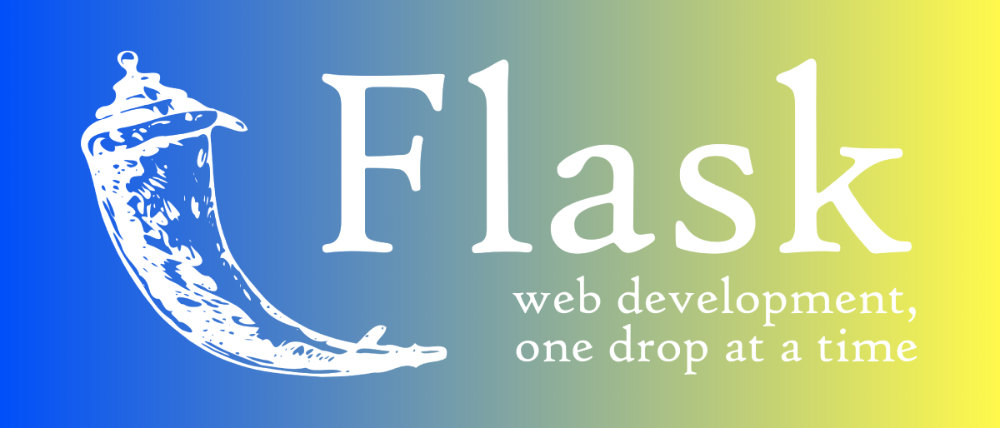

# Flask Web (server) Application for User Spending Analysis

## Overview
This Flask application provides APIs to analyze user spending data stored in a SQL database. It allows you to retrieve the total spending by a specific user and calculate the average spending by age ranges. Additionally, it demonstrates how to integrate MongoDB for storing users that exceed specific amount of total spending. In that way, the MongoDB can be accessed for getting the user IDs of the users that are eligible for a bonus voucher at the end of the year.

Furthermore this application will show graphically (pie chart and bar graph) the average spending by age ranges, and will send Telegram messages with calculated statistics to the store management.

## Requirements
  * Python 3.x
  * installed Flask framework
  * installed modules : pymongo, requests, jsonify, json, matplotlib.pyplot
  * download Telegram and join the group : https://t.me/statisticki_podatoci

## Installation 

> $ pip install Flask 

> $ pip install pymongo[srv]
> $ git clone https://github.com/TamaraNeshovska/Proekt

* Run the project 
> $ python proekt1.py

* The Flask application with the specified APIs should be up and running (on localhost or cloud).

## Explanation of APIs endpoints

* First : Retrieves the total spending for a specific user based on entered user ID
* Second: Retrieves the average spending for different age ranges, show its graphically and sends the results to specific Telegram group
* Third: Allows clients to submit user data that exceeds specific amount of spending equal to 2000 in JSON format, which is then inserted into a MongoDB collection.
